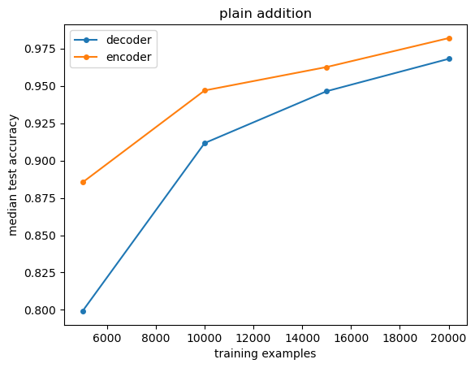
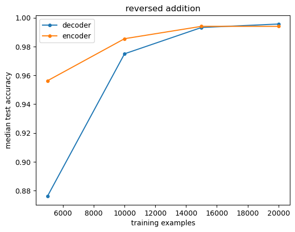

# Addition with Encoder-Only Transformers

### Encoder-Only Autoregressive Transformer
- Like decoder-only transformer, but without causal attention
- Since there is no causal masking, we need to do the forward pass seperately for each token

```python
def decoder_forward(self, x: Tensor) -> Tensor:
    for block in self.h:
        x = block(x)
    return self.ln_f(x)

def encoder_forward(self, x: Tensor) -> Tensor:
    y = torch.zeros_like(x)
    for t in range(x.shape[1]):
        x_t = x[:, : t + 1]
        for block in self.h:
            x_t = block(x_t)
        y[:, t] = self.ln_f(x_t[:, t])
    return y
```

### Task
- The goal of this experiment is to compare decoder and encoder autoregressive transformers of addition
- There are two variations of addition tasks
    - Plain addition: `$123+456=579$`
    - Reversed addition: `$123+456=975$`
    - `$` delimeters are used for both tasks, unlike Nayoung's paper
    

### Method
- We start with all 1,000,000 3-digit, 2-digit, and 1-digit addition examples
- We randomly remove 90% of the 3-digit addition examples, adjusting the ratio of 
    3-digit to 2-digit examples from 100:1 to 10:1
- We split the data into training, testing, and validation splits, stratified by the 
    number of digits and carrys in each addition example
- The dataset generation is seeded, so it is reproducible
- The transformers are trained like standard autoregressive language models
- Since the models tended to overfit the training dataset, We saved the model with 
    the best performance on a validation dataset
- After training, we evaluate the accuracy of the models on the test dataset
- We tested all combinations of the parameters listed below
    - Decoder-only or encoder-only transformer
    - Plain or reversed addition
    - 5k, 10k, 15k, or 2k training examples
- Each combination was tested of 5 different seeds
- We reran a small number of trials to make sure are results were consistent across runs 

### Results





- The encoder-only transformer performs considerably better than the decoder-only transformer
    on plain addition for all training dataset sizes

- The encoder-only performs better than the decoder only transformer on reversed addition for 
    smaller training datasets, and performs about the same on larger training datasets